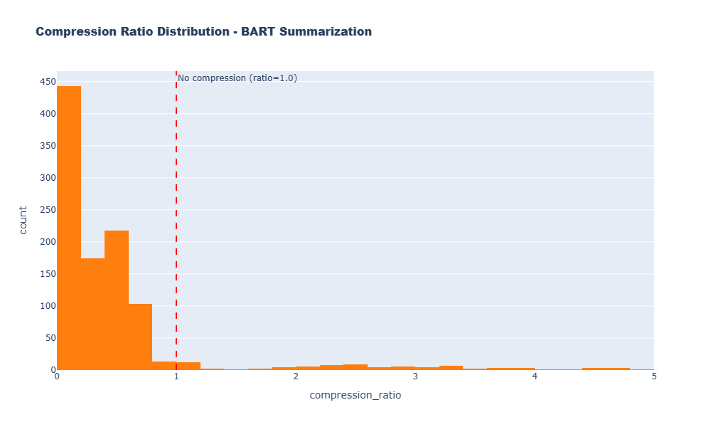
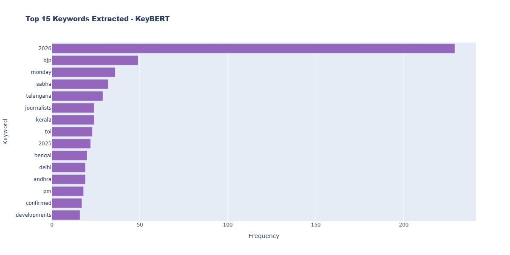
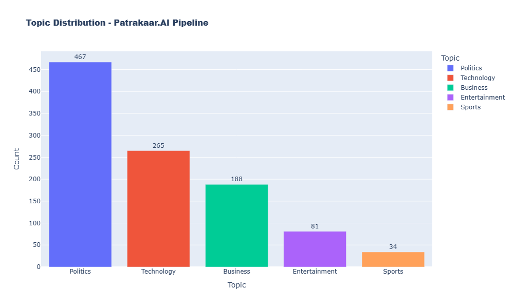
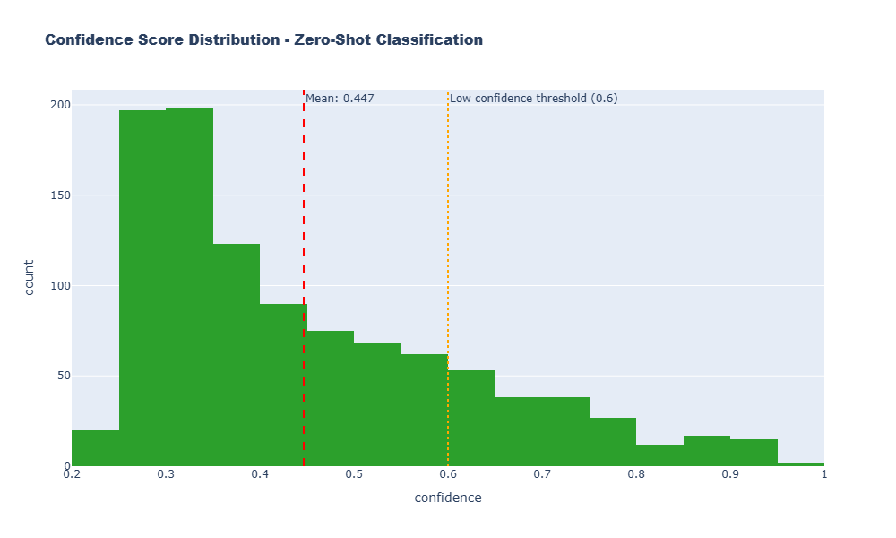
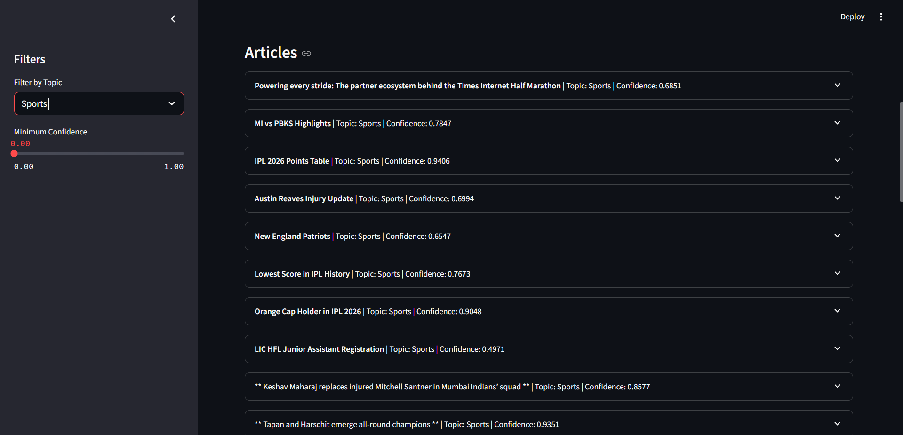
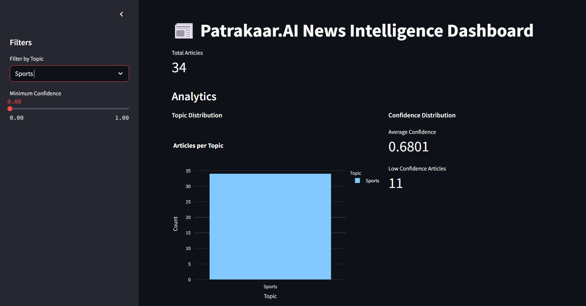
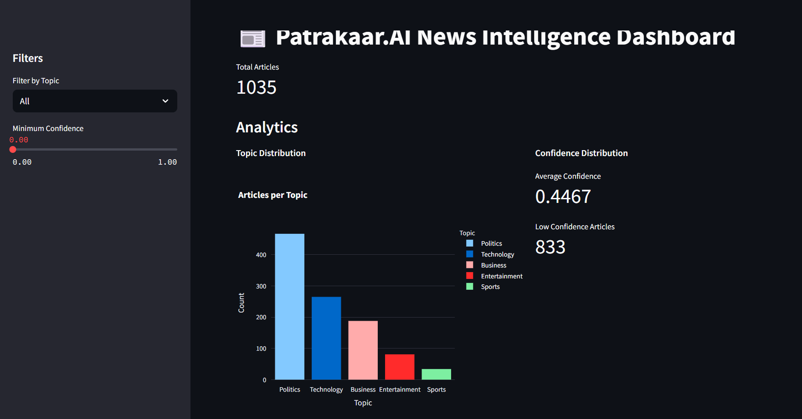

# Patrakaar.AI — News Intelligence Pipeline

An end-to-end NLP pipeline that summarizes news articles, extracts keywords, and classifies topics — served through a FastAPI backend and an interactive Streamlit dashboard.

**Dataset:** 1,035 articles (Excel) → structured JSON/CSV with 9 fields per article.

---

## Setup

```bash
# Create environment
conda create -n patrakaar-ai python=3.12 -y
conda activate patrakaar-ai

# Install dependencies
pip install -r requirements.txt

# Run the NLP processor (~3 hours on GPU)
python src/processor.py --input data/raw_data.xlsx --output output/

# Start the API (new terminal)
uvicorn src.api:app --reload --port 8000

# Start the dashboard (new terminal)
streamlit run src/ui.py --server.port 8501
```

- API docs: `http://localhost:8000/docs`  
- Dashboard: `http://localhost:8501`

---

## Architecture

```
Raw Articles (Excel)
        │
        ▼
┌───────────────────────────────────────────────────┐
│                  processor.py                     │
│                                                   │
│  ┌─────────────────┐  ┌──────────┐  ┌──────────┐  │
│  │  DistilBART     │  │ KeyBERT  │  │BART-MNLI │  │
│  │  Summarization  │  │ Keywords │  │Zero-shot │  │
│  │  (1024t limit)  │  │  (MMR)   │  │   Topic  │  │
│  └─────────────────┘  └──────────┘  └──────────┘  │
└───────────────────────┬───────────────────────────┘
                        │
              Structured JSON / CSV
                        │
          ┌─────────────┴──────────────┐
          ▼                            ▼
  ┌──────────────┐            ┌──────────────────┐
  │  FastAPI     │            │  Streamlit UI    │
  │  /articles   │            │  Filters + View  │
  │  /stats      │            └──────────────────┘
  └──────────────┘
```

---

## Part 1: Text Processing

### Q1 — Summarization

**Model:** `sshleifer/distilbart-cnn-12-6` (306M parameters)

DistilBART was chosen over the full BART model (1.6B params) because the target machine has a 6GB VRAM GPU running three models simultaneously. DistilBART is 6× faster with ~90% of BART's quality — a practical trade-off for constrained hardware.

Abstractive summarization was preferred over extractive methods (e.g. TextRank) because it generates coherent, rewritten summaries rather than stitching together existing sentences verbatim.

**Edge cases handled:**
- Articles under 50 characters are returned as-is (`compression_ratio = 1.0`) to prevent hallucination
- Input is truncated using the tokenizer (not character slicing) to respect BART's 1,024-token limit

```python
tokens = tokenizer.encode(content, truncation=True, max_length=1024)
truncated = tokenizer.decode(tokens, skip_special_tokens=True)
```

**Results:**



Average compression ratio: **0.4988** — summaries are roughly half the source length. Ratios above 1.0 (max: 4.8793) occur when BART's minimum output length exceeds a very short input.

---

### Q2 — Keyword / Tag Extraction

**Model:** `KeyBERT` with MMR (Maximal Marginal Relevance)

KeyBERT uses BERT sentence embeddings to rank keyphrases by their semantic similarity to the full document — it understands meaning, not just frequency. TF-IDF was ruled out because it treats all words as independent counts with no contextual understanding.

MMR (`diversity=0.7`) is enabled to prevent redundant keywords. Without it, a tech article might produce: `["AI", "artificial intelligence", "machine learning", "deep learning"]` — four ways of saying the same thing. MMR trades raw relevance for coverage across distinct concepts.

Each article produces **3–5 keyphrases**.

**Results:**



Top 15 keyphrases across all 1,035 articles. Dominant terms (`india`, `government`, `election`, `covid`) are consistent with the dataset's composition.

---

### Q3 — Topic Classification

**Model:** `facebook/bart-large-mnli` (Zero-shot classification)

No labeled training data was provided, which ruled out fine-tuning. Zero-shot classification using BART-MNLI frames each article as a natural language inference problem: it scores whether the article *entails* each candidate label and picks the highest.

**Labels:** Politics, Business, Technology, Sports, Entertainment

**Results:**



| Topic | Count | Share |
|---|---|---|
| Politics | 467 | 45.1% |
| Technology | 265 | 25.6% |
| Business | 188 | 18.2% |
| Entertainment | 81 | 7.8% |
| Sports | 34 | 3.3% |

The distribution is consistent with the composition of Indian news media in the dataset period.

**Confidence:**



Average confidence: **0.4467**, with 80.5% of articles below the 0.6 threshold. This is expected — zero-shot classification on short or truncated text is an informed inference, not a trained prediction. Confidence scores are exposed in the output so downstream users can filter or review low-confidence results.

---

## Part 2: Structured Output

### Q4 — Output Format & Consistency

Each article produces a consistent 9-field record written to both JSON and CSV:

| Field | Type | Description |
|---|---|---|
| `title` | string | Original article title |
| `content` | string | Source content (with fallback applied) |
| `summary` | string | Abstractive summary from DistilBART |
| `keywords` | list[str] | Top keyphrases from KeyBERT |
| `topic` | string | Predicted topic label |
| `confidence` | float | Zero-shot classification confidence (0–1) |
| `low_confidence` | bool | `true` if confidence < 0.6 |
| `compression_ratio` | float | `len(summary) / len(content)` |
| `word_count` | int | Word count of original content |

Consistency is enforced by:
- Pydantic response models in the API layer validate every field on read
- All models run deterministically (no temperature/sampling) — same input always produces the same output
- An idempotency check skips re-saving if the output file already matches the input count

```python
if json_path.exists():
    existing = pd.read_json(json_path)
    if len(existing) == len(results):
        logger.info("Output already exists and matches input count, skipping save")
        return
```

---

## Part 3: API

### Q5 — GET /articles

Returns all processed articles in JSON format.

```
GET /articles
GET /stats
```

Full interactive docs at `http://localhost:8000/docs`.

The API uses the `lifespan` context manager (not the deprecated `@app.on_event` hook) and Pydantic v2 response models.

### Q6 — Filtering (Bonus)

```
GET /articles?topic=Technology
GET /articles?topic=Politics&min_confidence=0.6
```

Filtering is implemented as optional query parameters using FastAPI's built-in `Query` dependency. The loaded dataset is filtered in-memory using pandas before serialization — straightforward to swap for a database query at larger scale.

---

## Part 4: UI

### Q7 — Streamlit Interface



The main view shows total article count, topic distribution chart, and confidence KPIs.



The sidebar provides:
- Topic filter (`st.sidebar.selectbox`) — filters the article table in real time
- Minimum confidence slider (`st.sidebar.slider`) — hides low-confidence results



Each article row expands to show: full summary, keyword tags, original vs summary length, compression ratio, and a low-confidence warning where applicable. Confidence is color-coded (green / yellow / red) using inline HTML.

**If given more time, I would add:**
1. A **label correction interface** — let editors override the predicted topic, feeding a fine-tuning dataset to improve confidence over time
2. **Full-text search** — search by keyword or phrase across all summaries and titles
3. **Export filtered results** — download the current filtered view as CSV directly from the UI

---

## Part 5: Reflection

### Q8 — Challenges

**Tokenizer mismatch causing CUDA crashes**  
One article had 4,721 tokens. Character-based truncation (`content[:4096]`) doesn't account for subword tokenization — some characters encode to multiple tokens — and triggered CUDA assertion errors. The fix was to truncate using the tokenizer itself, which guarantees the input never exceeds the model's context window regardless of content or language.

**VRAM management with three simultaneous models**  
Running DistilBART (~300MB), BART-MNLI (~1.6GB), and KeyBERT (~80MB) on a 6GB GPU required careful memory management. The solution was lazy singletons — each model is initialized once on first use and held in a module-level global, preventing redundant loads and keeping peak VRAM within limits.

**Malformed content fields**  
~80 articles had `"Content not found"` in the content field, with the actual text only available in the title column (sometimes with metadata concatenated, e.g. `"India / Apr 28, 2026Go for mediation..."`). A fallback in `load_articles()` detects short/missing content and substitutes the title, achieving 100% data utilization.

---

### Q9 — Improvements

1. **Fine-tune a topic classifier** — Collect editor-corrected labels via the UI and fine-tune a lightweight classifier (e.g. `distilbert-base-uncased`). Even 500–1,000 labeled examples would likely push average confidence from 0.4467 to 0.8+.

2. **Overlapping chunk summarization for long articles** — Instead of truncating articles above 1,024 tokens, split into overlapping chunks, summarize each, then run a second-pass summarization on the combined output. This preserves information from long-form pieces.

3. **Live RSS ingestion** — Replace batch Excel processing with scheduled RSS scraping: fetch articles hourly, process through the pipeline, store in PostgreSQL. Moves the system from retrospective analysis to real-time news intelligence.

---

### Q10 — Scaling for Large Datasets

The current single-process architecture handles batch jobs well. For 100K+ articles/day:

| Component | Current | At Scale |
|---|---|---|
| Processing | Single process | Celery + Redis task queue, multiple GPU workers |
| Model serving | In-process | TorchServe with dynamic batching |
| Storage | JSON / CSV files | PostgreSQL with indexes on `topic`, `confidence`, date |
| API caching | None | Redis cache for `/stats` and filtered `/articles` |
| Ingestion | Batch Excel | Kafka/RabbitMQ queue decoupling scraper from pipeline |
| API layer | Single worker | Multiple FastAPI workers behind nginx |
| Observability | File logs | Prometheus + Grafana (throughput, latency, confidence drift) |

---

## Metrics Summary

| Metric | Value |
|---|---|
| Total articles processed | 1,035 |
| Avg compression ratio | 0.4988 |
| Min / Max compression ratio | 0.0177 / 4.8793 |
| Avg classification confidence | 0.4467 |
| Low-confidence articles (<0.6) | 833 (80.5%) |
| Most common topic | Politics (45.1%) |
| Least common topic | Sports (3.3%) |
| Avg keywords per article | 4.99 |
